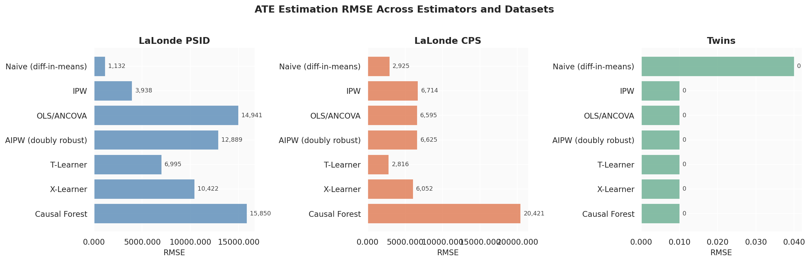
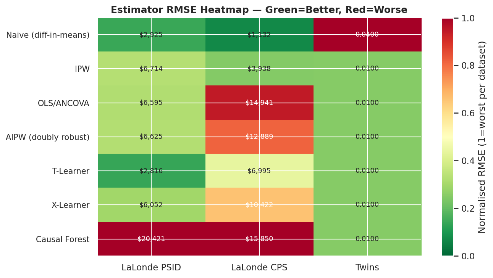
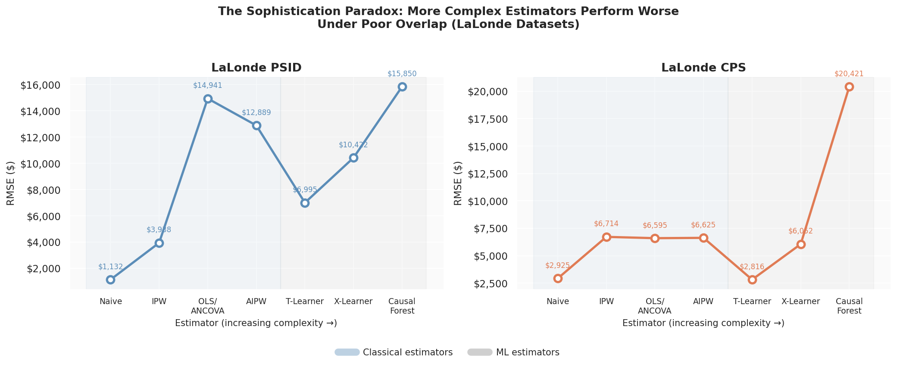
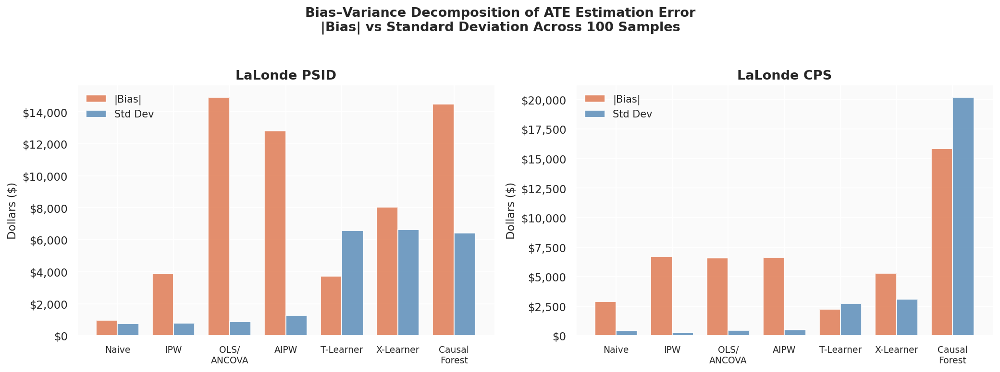
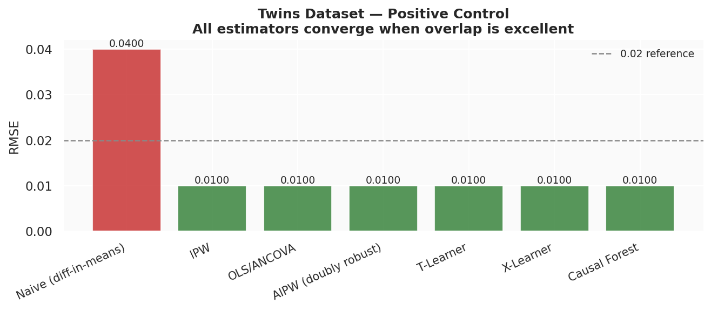

# Causal Benchmark: When Does Sophistication Hurt?

> **Benchmarking Causal Estimators Under Realistic Overlap Violations**

[](https://www.python.org/)
[](LICENSE)
[](https://github.com/bradyneal/realcause)
[](https://colab.research.google.com/)

---

## Overview

This repository contains the full code, results, and figures for the paper:

**"When Does Sophistication Hurt? Benchmarking Causal Estimators Under Realistic Overlap Violations"**

We benchmark **7 causal estimators** — from naive diff-in-means to modern machine learning methods — across **3 realistic datasets** from the [RealCause framework](https://github.com/bradyneal/realcause), evaluated over **100 independent samples each** (2,100 total evaluations).

### Headline Findings

| Finding | Result |
|---|---|
| **Sophistication Paradox** | On LaLonde datasets, Naive estimator achieves lowest RMSE ($1,132). Causal Forest performs worst ($15,850–$20,421). |
| **Best ML Estimator** | T-Learner is best among ML methods on both LaLonde datasets (RMSE $2,816 on CPS). |
| **Statistical Significance** | T-Learner beats all competitors on LaLonde CPS (Wilcoxon p < 0.001, effect size r = 0.944–0.956). |
| **Positive Control** | All estimators converge to RMSE ≈ 0.01 on Twins — method choice only matters under poor overlap. |

---

## Repository Structure

```
Causal_Benchmark/
├── notebook/
│   └── causal_benchmark.ipynb       # Full Colab notebook — data loading to figures
├── results/
│   ├── benchmark_results_extended.csv   # Full per-sample results (2,100 rows)
│   └── benchmark_summary_extended.csv   # Aggregated RMSE and bias per estimator
├── figures/
│   ├── fig1_rmse_comparison.png         # RMSE bar chart across estimators
│   ├── fig2_bias_distribution.png       # Bias distribution box plots (20 samples)
│   ├── fig3_rmse_heatmap.png            # Normalised RMSE heatmap
│   ├── fig4_sophistication_paradox.png  # RMSE vs estimator complexity line plot
│   ├── fig5_bias_variance.png           # Bias–variance decomposition
│   └── fig6_twins_positive_control.png  # Twins positive control bar chart
├── README.md
└── LICENSE
```

---

## Datasets

All datasets are sourced from the [RealCause framework](https://github.com/bradyneal/realcause) (Gentzel et al., 2021), which fits deep generative models to real experimental data, producing realistic synthetic samples with known ground-truth causal effects.

| Dataset | Source | n (per sample) | Overlap | True ATE |
|---|---|---|---|---|
| **LaLonde PSID** | Dehejia & Wahba (1999) + PSID controls | ~2,675 | Poor | ~−$13,800 (generative model) |
| **LaLonde CPS** | Dehejia & Wahba (1999) + CPS controls | ~16,177 | Poor | ~−$13,800 (generative model) |
| **Twins** | Louizos et al. (2017) | ~11,400 | Excellent | ~0 (binary outcome) |

Each dataset is available as 100 pre-generated samples in `realcause/realcause_datasets/`, each containing covariates `W`, treatment `t`, observed outcome `y`, and ground-truth potential outcomes `y0`, `y1`, `ite`.

---

## Estimators

| # | Estimator | Type | Library |
|---|---|---|---|
| 1 | Naive (diff-in-means) | Classical | `numpy` |
| 2 | IPW | Classical | `sklearn` |
| 3 | OLS / ANCOVA | Classical | `sklearn` |
| 4 | AIPW (Doubly Robust) | Classical | `sklearn` |
| 5 | T-Learner | ML meta-learner | `econml` |
| 6 | X-Learner | ML meta-learner | `econml` |
| 7 | Causal Forest (DML) | ML causal forest | `econml` |

---

## Quickstart

### 1. Clone this repository and RealCause

```bash
git clone https://github.com/your-username/Causal_Benchmark.git
cd Causal_Benchmark

# Clone RealCause for the pre-computed datasets
git clone https://github.com/bradyneal/realcause.git
cd realcause
```

### 2. Install dependencies

```bash
pip install pandas numpy scipy scikit-learn econml matplotlib seaborn
```

> **Note:** RealCause was built for `pandas < 2.0`. If you are running `pandas >= 2.0` (Python 3.10+), apply the patch below before running any RealCause data loading code.

```python
# Patch for pandas 2.x compatibility — run once in your environment
from pathlib import Path

fpath = Path("realcause/data/lalonde.py")
src   = fpath.read_text()
src   = src.replace(
    "combined_df = rct_df[rct_df.treat == 1].append(obs_df)",
    "combined_df = pd.concat([rct_df[rct_df.treat == 1], obs_df], ignore_index=True)"
)
fpath.write_text(src)
print("Patched successfully")
```

### 3. Load pre-computed benchmark results (no re-running needed)

```python
import pandas as pd

results = pd.read_csv("results/benchmark_results_extended.csv")
summary = pd.read_csv("results/benchmark_summary_extended.csv")

print(results.shape)       # (2100, 8)
print(summary.to_string())
```

### 4. Run the full notebook

Open `notebook/causal_benchmark.ipynb` in [Google Colab](https://colab.research.google.com/) or Jupyter. The notebook is self-contained and walks through:

1. Loading and patching RealCause
2. Loading all 300 pre-computed samples
3. Running all 7 estimators across all 3 datasets
4. Generating all 6 figures
5. Running Wilcoxon signed-rank tests with Bonferroni correction
6. Producing the bias–variance decomposition

> **Colab tip:** Results are automatically saved to CSV after each dataset completes, so a session reset only loses progress within the current dataset — not everything.

---

## Results

### Summary Table (RMSE, 100 samples each)

| Estimator | LaLonde PSID | LaLonde CPS | Twins |
|---|---|---|---|
| Naive (diff-in-means) | **$1,132** ✅ | $2,925 | 0.040 |
| IPW | $3,938 | $6,714 | 0.010 |
| OLS / ANCOVA | $14,941 | $6,595 | 0.010 |
| AIPW (Doubly Robust) | $12,889 | $6,625 | 0.010 |
| T-Learner | $6,995 🟠 | **$2,816** ✅🟠 | 0.010 |
| X-Learner | $10,422 | $6,052 | 0.010 |
| Causal Forest | $15,850 ❌ | $20,421 ❌ | 0.010 |

✅ Best overall &nbsp; 🟠 Best ML estimator &nbsp; ❌ Worst

### Wilcoxon Tests — T-Learner vs All (LaLonde CPS, n=100)

| Comparison | T-Learner \|Bias\| | Competitor \|Bias\| | p (Bonf.) | Effect size r |
|---|---|---|---|---|
| vs Naive | $2,241 | $2,893 | < 0.001 *** | +0.427 (medium) |
| vs IPW | $2,241 | $6,708 | < 0.001 *** | +0.956 (large) |
| vs OLS/ANCOVA | $2,241 | $6,579 | < 0.001 *** | +0.944 (large) |
| vs AIPW | $2,241 | $6,608 | < 0.001 *** | +0.945 (large) |
| vs X-Learner | $2,241 | $5,284 | < 0.001 *** | +0.613 (large) |
| vs Causal Forest | $2,241 | $15,863 | < 0.001 *** | +0.808 (large) |

**LaLonde PSID note:** On PSID, the Naive estimator significantly outperforms T-Learner (p < 0.001, |bias| $960 vs $3,725), demonstrating that under extreme overlap violations, no ML estimator can beat ignoring covariates entirely.

---

## Figures

### Figure 1 — RMSE Comparison


### Figure 3 — RMSE Heatmap


### Figure 4 — The Sophistication Paradox

*On both LaLonde datasets, RMSE increases monotonically with estimator complexity. The naive estimator outperforms Causal Forest by 14x on PSID.*

### Figure 5 — Bias–Variance Decomposition

*Classical estimators show high bias, low variance. ML estimators show the reverse. Causal Forest on CPS has std dev ≈ $20,000 — extreme sample-to-sample instability.*

### Figure 6 — Twins Positive Control

*Under good overlap, all covariate-adjusted estimators converge to RMSE ≈ 0.01. Method choice is irrelevant when assumptions hold.*

---

## Practical Decision Framework

Before selecting a causal estimator, compute propensity score overlap diagnostics (SMD per covariate + overlap coefficient). Then apply:

| Overlap condition | SMD | Recommended | Avoid |
|---|---|---|---|
| **Excellent** | All SMD < 0.1 | AIPW or OLS/ANCOVA | — |
| **Moderate** | Some SMD 0.1–0.3 | T-Learner | Causal Forest |
| **Poor** | SMD > 0.3 on 3+ covariates | Naive or T-Learner | OLS, AIPW, Causal Forest |
| **Extreme mismatch** | PS scores near 0 or 1 | Report as unidentified | All estimators |

---

## Dependencies

```
pandas>=1.5.3
numpy>=1.23
scipy>=1.10
scikit-learn>=1.2
econml>=0.14
matplotlib>=3.7
seaborn>=0.12
```

> If using `pandas >= 2.0`, apply the RealCause patch described in the Quickstart section.

---

## Citation

If you use this code or results in your work, please cite:

```bibtex
@inproceedings{yourname2025sophistication,
  title     = {When Does Sophistication Hurt? Benchmarking Causal Estimators
               Under Realistic Overlap Violations},
  author    = {Anonymous},
  booktitle = {[Conference Name]},
  year      = {2025}
}
```

This work builds on the RealCause framework:

```bibtex
@inproceedings{gentzel2021realcause,
  title     = {How and Why to Use Experimental Data to Evaluate Methods
               for Observational Causal Inference},
  author    = {Gentzel, Amanda and Pruthi, Purva and Jensen, David},
  booktitle = {Proceedings of ICML},
  year      = {2021}
}
```

---

## License

MIT License. See [LICENSE](LICENSE) for details.

---

## Acknowledgements

This work uses the [RealCause](https://github.com/bradyneal/realcause) framework and pre-trained generative models from Gentzel et al. (2021). The LaLonde datasets originate from Dehejia & Wahba (1999) and LaLonde (1986). The Twins dataset is from Louizos et al. (2017). Causal ML estimators use the [EconML](https://github.com/py-why/EconML) library from Microsoft Research.

